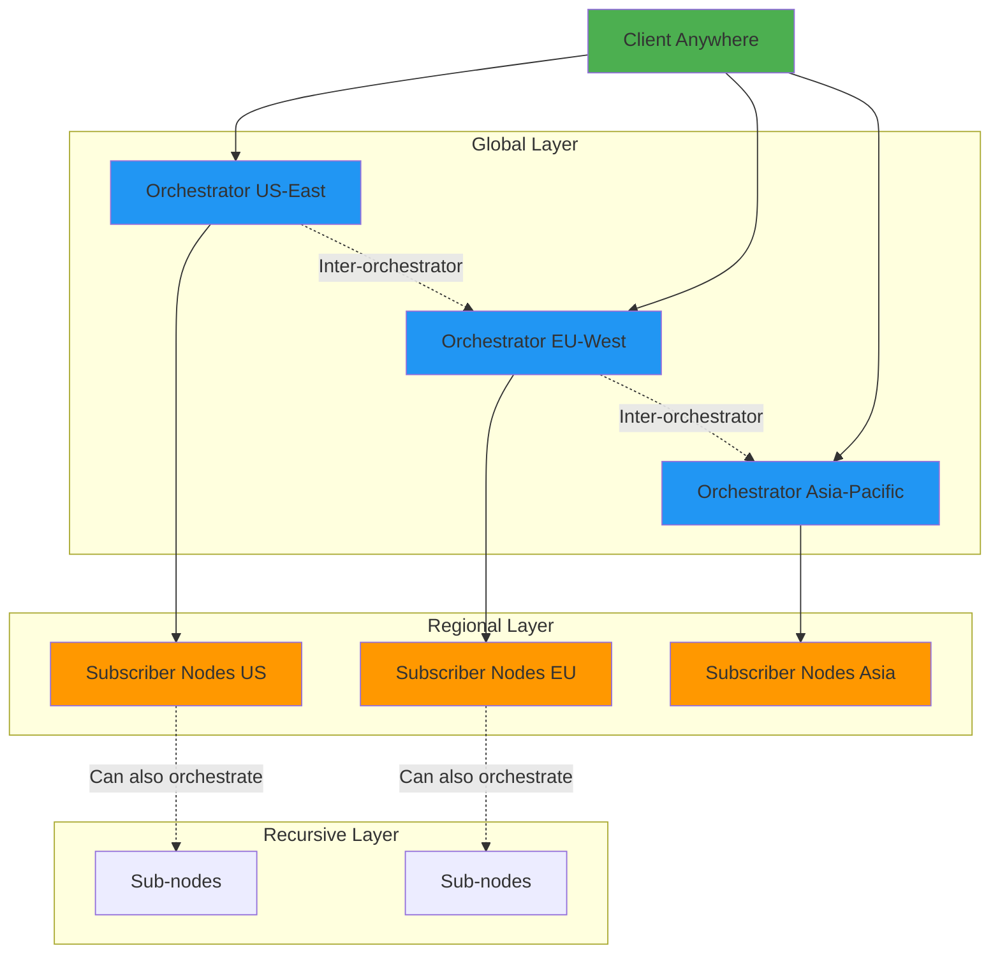

# ExoCompute - The World Computer

> **A decentralized compute grid that brings the vision of a global, distributed supercomputer to reality.**

[](https://opensource.org/licenses/MIT)
[](https://www.python.org/downloads/)

---

## 🌍 Vision

**The vision is simple but world-changing:** 
A student in a remote village training a life-saving medical AI using the idle power of thousands of dormant gaming PCs in Tokyo. A local community predicting a wildfire’s path in real-time by tapping into a shared mesh of office workstations in London. A world where the next scientific breakthrough isn't limited by a researcher's bank account, but fueled by the collective, wasted capacity of our shared humanity. 

ExoCompute turns the world’s quiet silicon into a global, decentralized supercomputer for everyone.

---

## ✨ What Makes ExoCompute Different?

### 🔄 **Recursive Orchestration**
Unlike traditional compute grids, **subscribers can also be orchestrators**. This enables:
- **Infinite horizontal scaling** - No single point of coordination
- **Hierarchical task distribution** - Orchestrators can delegate to other orchestrators
- **Geographic distribution** - Regional orchestrators managing local nodes
- **Fault-tolerant architecture** - If one orchestrator fails, others continue

### ⚡ **Zero Friction Onboarding**
Getting started takes **less than 2 minutes**:
```bash
# 1. Clone and install
git clone https://github.com/yourname/ExoCompute.git && cd ExoCompute
pip install -r requirements.txt

# 2. Become a node (contributor)
python -m exocompute.subscriber --count 1

# 3. Use the compute grid (consumer)
python user.py
```

That's it. No complex configuration, no infrastructure setup, no cloud accounts.

### 🔌 **Pluggable Compute Units**
Write your logic once, run it anywhere:
```python
class MyCustomUnit(ComputeUnit):
    class Input(ComputeInput):
        data: str
    
    class Output(ComputeOutput):
        result: str
    
    def compute(self, input_data: Input) -> Output:
        return self.Output(result=input_data.data.upper())
```

The framework handles everything else—distribution, scheduling, retries, and results aggregation.

---

## 🚀 Quick Start

### For Compute Consumers (Users)

```python
from exocompute.client import ExoCompute
from exocompute.libs.mul import Mul

# Connect to any orchestrator
exo = ExoCompute("http://localhost:8000", Mul)

# Submit tasks
result = exo.compute(Mul.Input(a=10, b=20))
print(result)  # {'result': 200}
```

### For Compute Contributors (Node Operators)

```bash
# Start a subscriber node and contribute your compute
python -m exocompute.subscriber --count 3
```

Your node is now part of the global compute grid! 🌐

### For Orchestrator Operators

```bash
# Run an orchestrator to coordinate local or global nodes
python -m exocompute.orchestrator
```

---

## 🏗️ Architecture at a Glance



**Recursive Power**: Any subscriber can become an orchestrator, enabling fractal-like scaling.

**Torrent-Style Discovery**: Orchestrators discover each other peer-to-peer (like BitTorrent trackers), eliminating the need for central registries and enabling true decentralization.

---

## 📚 Documentation

Dive deeper into ExoCompute:

- **[Getting Started Guide](docs/GETTING_STARTED.md)** - Step-by-step setup and first tasks
- **[Architecture Deep Dive](docs/ARCHITECTURE.md)** - How everything works under the hood
- **[Vision & Future](docs/VISION.md)** - The world computer, practical applications, and roadmap
- **[How We're Different](docs/COMPARISON.md)** - ExoCompute vs. existing solutions
- **[API Reference](docs/API_REFERENCE.md)** - Complete API documentation
- **[Contributing Guide](docs/CONTRIBUTING.md)** - Help build the world computer

---

## 🎯 Real-World Applications

ExoCompute is already suitable for:

- **Scientific Computing**: Climate modeling, protein folding, astrophysics simulations
- **Machine Learning**: Distributed training, hyperparameter search, batch inference
- **Financial Analysis**: Risk modeling, algorithmic trading, fraud detection
- **Media Processing**: Video transcoding, 3D rendering, animation frame processing
- **Web3 & Blockchain**: Proof-of-work mining, IPFS pinning, smart contract execution
- **Edge Computing**: IoT data processing, real-time analytics

See [Vision & Future](docs/VISION.md) for detailed use cases.

---

## 🌟 Key Features

| Feature | Description |
|---------|-------------|
| 🔄 **Recursive Orchestration** | Nodes can coordinate other nodes, enabling infinite scale |
| 🌐 **Torrent-Style Discovery** | P2P orchestrator discovery, no central registry needed |
| ⚡ **2-Minute Onboarding** | Clone, install, run—no complex setup |
| 🔌 **Pluggable Units** | Write custom compute logic with simple Python classes |
| 🛡️ **Fault Tolerance** | Automatic retries and redundant execution |
| 📊 **Dynamic Scaling** | Add/remove nodes without downtime |
| 🌍 **Geo-Distributed** | Deploy orchestrators globally for low latency |
| 🧪 **Production-Ready Testing** | Comprehensive unit and integration tests |

---

## 📊 Performance

**Benchmark**: 5000 multiplication tasks

| Nodes | Time | Throughput |
|-------|------|------------|
| 1     | 38.2s | 131 tasks/s |
| 3     | 12.3s | 406 tasks/s |
| 10    | 4.2s | 1190 tasks/s |

**Near-linear scaling** with proper orchestrator distribution.

---

## 🤝 Contributing

ExoCompute is open source and community-driven. We welcome:

- 🐛 Bug reports and fixes
- ✨ Feature implementations
- 📖 Documentation improvements
- 🧪 Test coverage expansion
- 💡 New compute unit examples

See [CONTRIBUTING.md](docs/CONTRIBUTING.md) for details.

---

## 📄 License

MIT License - See [LICENSE](LICENSE) file for details.

---

## 🧑‍💻 Author

**Made with ambition and distributed systems by [Suyash]**

*"Let's build the world computer together."*

---

## 🔗 Quick Links

- [GitHub Repository](https://github.com/yourname/ExoCompute)
- [Documentation](docs/)
- [Issue Tracker](https://github.com/yourname/ExoCompute/issues)
- [Discussions](https://github.com/yourname/ExoCompute/discussions)

---

**Ready to contribute to the world computer?** [Get Started](docs/GETTING_STARTED.md) →