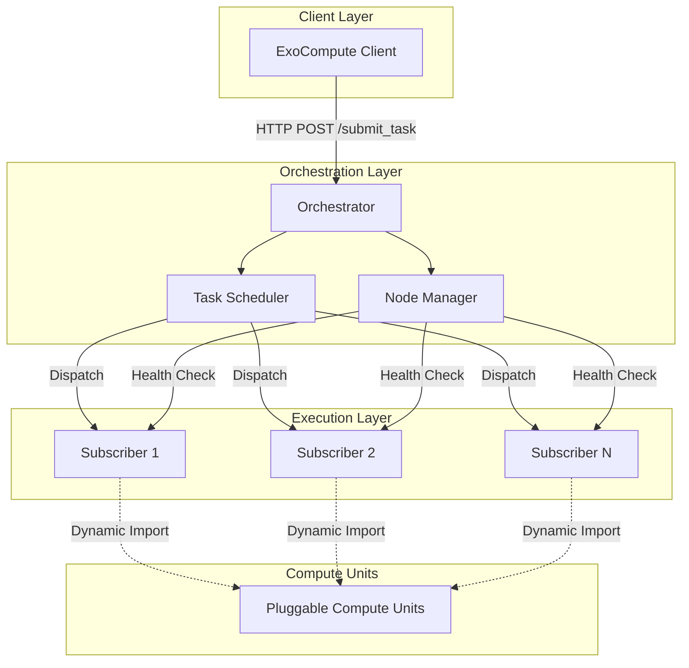
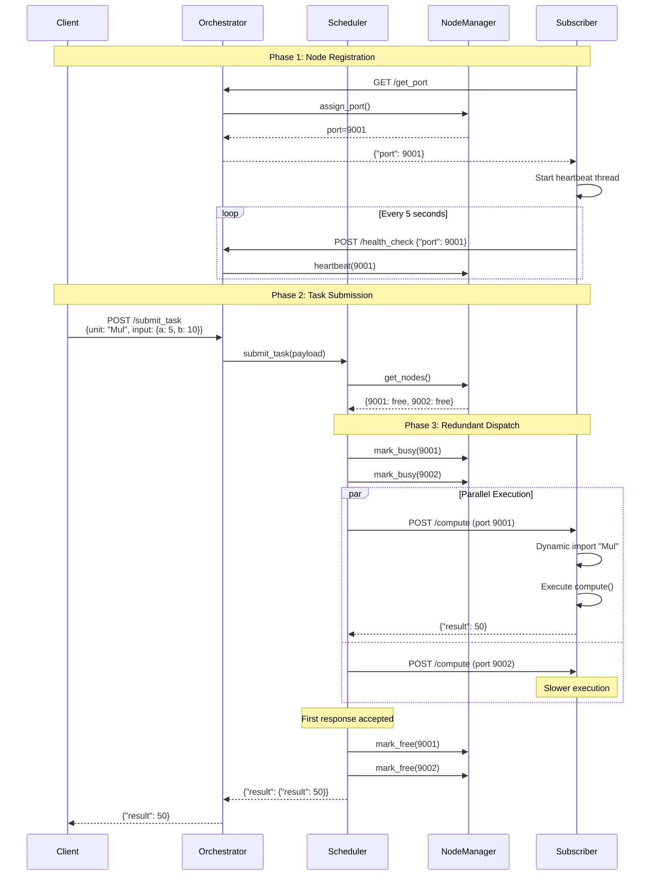

# Architecture Deep Dive

This document provides a comprehensive technical explanation of ExoCompute's architecture, design decisions, and implementation details.

---

## 🏗️ System Overview

ExoCompute consists of three main components:

1. **Client SDK** - Submits tasks to orchestrators
2. **Orchestrator** - Coordinates subscribers and schedules tasks
3. **Subscriber** - Executes computational tasks



---

## 🔄 Task Execution Flow

### Complete Sequence Diagram



---

## 📦 Component Architecture

### 1. Client SDK

**Location:** `src/exocompute/client/client.py`

**Responsibilities:**
- Serialize compute inputs using Pydantic
- Send HTTP requests to orchestrator
- Handle errors and timeouts
- Return deserialized results

**Key Design Decisions:**

| Decision | Rationale |
|----------|-----------|
| **Synchronous API** | Simpler for users; can be wrapped in asyncio |
| **Type-Safe Inputs** | Pydantic validation catches errors early |
| **30s Timeout** | Balance between long tasks and hanging requests |

**Implementation:**
```python
class ExoCompute:
    def compute(self, input_data: ComputeInput) -> dict:
        payload = {
            "unit": self.unit_name,
            "input": input_data.model_dump()  # Pydantic v2
        }
        resp = requests.post(
            f"{self.orchestrator_url}/submit_task",
            json=payload,
            timeout=30.0
        )
        return resp.json()["result"]
```

---

### 2. Orchestrator

**Location:** `src/exocompute/orchestrator/`

#### 2.1 Server (`server.py`)

**FastAPI Application with 4 Endpoints:**

| Endpoint | Method | Purpose |
|----------|--------|---------|
| `/get_port` | GET | Assign port to new subscriber |
| `/submit_task` | POST | Submit task for execution |
| `/unregister` | POST | Remove subscriber from registry |
| `/health_check` | POST | Receive heartbeat from subscriber |

**Lifecycle Management:**
```python
@asynccontextmanager
async def lifespan(app: FastAPI):
    # Startup: Begin health monitoring
    node_manager.start_health_check()
    yield
    # Shutdown: Stop health monitoring
    node_manager.stop_health_check()
```

---

#### 2.2 Node Manager (`manager.py`)

**Responsibilities:**
- Port assignment (9001-9050)
- Node health tracking
- Busy/free state management
- Dead node removal

**Data Structure:**
```python
{
    9001: {
        "busy": False,
        "last_heartbeat": 1735077023.45
    },
    9002: {
        "busy": True,
        "last_heartbeat": 1735077020.12
    }
}
```

**Health Check Algorithm:**
```python
def _health_check_loop():
    while True:
        current_time = time.time()
        for port, info in nodes.items():
            if current_time - info["last_heartbeat"] > 15:
                # Node is dead, remove it
                unregister_node(port)
        time.sleep(5)
```

**Key Design Decisions:**

| Decision | Rationale |
|----------|-----------|
| **15s timeout** | 3x heartbeat interval (5s) for reliability |
| **Background thread** | Non-blocking health checks |
| **Asyncio locks** | Thread-safe state management |

---

#### 2.3 Task Scheduler (`scheduler.py`)

**Responsibilities:**
- Select available nodes
- Dispatch tasks with redundancy
- Handle retries
- Return first successful result

**Scheduling Algorithm:**

1. **Get available nodes** (not busy, not previously attempted)
2. **Select N nodes** based on `redundancy_factor` (default: 2)
3. **Mark nodes as busy** to prevent double-scheduling
4. **Dispatch in parallel** using asyncio tasks
5. **Wait for first success** using `asyncio.wait()`
6. **Mark all nodes as free** after completion

**Redundancy Benefits:**

| Scenario | Without Redundancy | With Redundancy (2x) |
|----------|-------------------|----------------------|
| **Normal** | 10ms latency | 10ms (no penalty) |
| **1 node slow** | 50ms latency | 10ms (fast node wins) |
| **1 node fails** | Task fails | 10ms (other node succeeds) |

**Retry Logic:**
```python
for attempt in range(retry_limit):  # 100 retries
    available_nodes = get_available_nodes()
    
    if not available_nodes:
        await asyncio.sleep(retry_delay)  # 0.1s
        continue
    
    # Dispatch and wait for results
    # ...
```

**Key Design Decisions:**

| Decision | Rationale |
|----------|-----------|
| **Redundancy factor = 2** | Balance between fault tolerance and overhead |
| **100 retries** | Handle temporarily unavailable nodes |
| **0.1s retry delay** | Avoid busy-waiting while staying responsive |
| **HTTPX async client** | Non-blocking HTTP requests |

---

### 3. Subscriber

**Location:** `src/exocompute/subscriber/`

#### 3.1 Core Logic (`core.py`)

**Responsibilities:**
- Register with orchestrator
- Maintain heartbeat
- Execute compute tasks
- Dynamic module imports

**Registration Flow:**
```python
def register():
    resp = requests.get(f"{orchestrator_url}/get_port")
    port = resp.json()["port"]
    self.assigned_port = port
    return port
```

**Heartbeat Thread:**
```python
def _heartbeat_loop():
    while not shutdown_flag:
        requests.post(
            f"{orchestrator_url}/health_check",
            json={"port": self.assigned_port}
        )
        time.sleep(5)
```

**Dynamic Compute Execution:**
```python
def process_compute(unit_type: str, data: dict):
    # 1. Dynamic import
    module = import_module(f"exocompute.libs.{module_name}")
    unit_class = getattr(module, unit_type)
    
    # 2. Parse input with Pydantic
    input_obj = unit_class.Input(**data)
    
    # 3. Execute computation
    unit_instance = unit_class()
    output_obj = unit_instance.compute(input_obj)
    
    # 4. Return serialized result
    return output_obj.model_dump()
```

**Module Mapping:**
```python
module_map = {
    'MatrixMultiplyUnit': 'matrix_ops',
    # Fallback: use lowercase(unit_name) as module name
}
```

---

#### 3.2 Server (`server.py`)

**FastAPI Application with 2 Endpoints:**

| Endpoint | Method | Purpose |
|----------|--------|---------|
| `/compute` | POST | Execute a compute task |
| `/health` | GET | Simple health check |

**Compute Endpoint:**
```python
@app.post("/compute")
async def compute(req: Request):
    payload = await req.json()
    unit = payload["unit"]
    input_data = payload["input"]
    
    result = subscriber_node.process_compute(unit, input_data)
    return result
```

---

### 4. Compute Units

**Location:** `src/exocompute/libs/`

**Base Classes:**
```python
class ComputeInput(BaseModel):
    """Pydantic model for type-safe inputs"""
    pass

class ComputeOutput(BaseModel):
    """Pydantic model for type-safe outputs"""
    pass

class ComputeUnit(ABC):
    """Abstract base class for all compute units"""
    Input: type[ComputeInput]
    Output: type[ComputeOutput]
    
    @abstractmethod
    def compute(self, input_data: ComputeInput) -> ComputeOutput:
        pass
```

**Example Implementation:**
```python
class MatrixMultiplyUnit(ComputeUnit):
    class Input(ComputeInput):
        matrix_a: List[List[float]]
        matrix_b: List[List[float]]
    
    class Output(ComputeOutput):
        result: List[List[float]]
        shape: List[int]
        computation_time: float
    
    def compute(self, input_data: Input) -> Output:
        a = np.array(input_data.matrix_a)
        b = np.array(input_data.matrix_b)
        result = np.matmul(a, b)
        
        return self.Output(
            result=result.tolist(),
            shape=list(result.shape),
            computation_time=time.time() - start
        )
```

**Key Design Decisions:**

| Decision | Rationale |
|----------|-----------|
| **Pydantic for I/O** | Type safety, automatic validation, serialization |
| **Abstract base class** | Enforce consistent interface |
| **Dynamic imports** | No code deployment needed, just add new files |
| **Nested Input/Output** | Clean namespace, clear ownership |

---

## 🔄 Recursive Orchestration Architecture

### Traditional vs. Recursive

**Traditional (Single-Tier):**
```
         Orchestrator
        /     |      \
    Node1  Node2  Node3
```
**Limitation:** Orchestrator bottleneck at ~1000 nodes

---

**Recursive (Multi-Tier):**
```
            Tier 1 Orchestrator
           /          |         \
    Tier 2 Orch   Tier 2 Orch   Tier 2 Orch
     /    \         /    \        /     \
   N1    N2       N3    N4      N5     N6
    |                   |              |
   N7            Tier 3 Orch          N8
                  /    \
                N9    N10
```
**Benefit:** Infinite scalability, no bottleneck

---

### Implementation Strategy

**Key Insight:** Any subscriber can also run an orchestrator on a different port.

**Setup:**
```bash
# Node becomes both subscriber AND orchestrator
python -m exocompute.subscriber --orchestrator http://parent:8000 &
python -m exocompute.orchestrator --port 8001 &
```

**Task Routing:**
1. Client submits to Tier 1 orchestrator
2. Tier 1 delegates to Tier 2 orchestrator (which is also a subscriber)
3. Tier 2 delegates to leaf nodes
4. Results propagate back up

**Inter-Orchestrator Communication (Future):**
```python
class OrchestratorUnit(ComputeUnit):
    """Special unit that delegates to another orchestrator"""
    class Input(ComputeInput):
        target_orchestrator: str
        task_payload: dict
    
    class Output(ComputeOutput):
        result: dict
    
    def compute(self, input_data: Input) -> Output:
        # Forward task to another orchestrator
        resp = requests.post(
            f"{input_data.target_orchestrator}/submit_task",
            json=input_data.task_payload
        )
        return self.Output(result=resp.json())
```

---

## 🛡️ Fault Tolerance Mechanisms

### 1. Heartbeat-Based Health Monitoring

**Problem:** Nodes crash without notice

**Solution:**
- Subscribers send heartbeat every 5s
- Orchestrator marks nodes dead after 15s silence
- Dead nodes removed from registry

### 2. Redundant Task Execution

**Problem:** Single node failure causes task failure

**Solution:**
- Send same task to N nodes (default N=2)
- Accept first successful response
- Ignore slower/failed redundant executions

### 3. Automatic Retries

**Problem:** Temporarily no available nodes

**Solution:**
- Retry up to 100 times with 0.1s delay
- Total patience: 10 seconds before giving up

### 4. Graceful Degradation

**Problem:** Orchestrator dies

**Solution (Future):**
- Clients can submit to any orchestrator
- Orchestrators sync state via distributed consensus
- Byzantine fault tolerance with 3+ orchestrators

---

## 📊 Performance Characteristics

### Latency Analysis

**Single Task Breakdown:**
```
Client → Orchestrator:        2ms
Orchestrator → Scheduler:     0.5ms
Scheduler → Subscriber:       1ms
Subscriber compute:           0.1ms (Mul) to 10s (Matrix)
Subscriber → Scheduler:       1ms
Scheduler → Client:           2ms
─────────────────────────────────
Total Overhead:               ~7ms
```

**Optimization Opportunities:**
- Use persistent HTTP connections (✅ already using httpx.AsyncClient)
- Cache dynamic imports (✅ Python's import system does this)
- Use WebSocket for streaming tasks (🚧 future)

---

### Throughput Analysis

**Factors:**
1. **Network latency:** ~7ms overhead per task
2. **Orchestrator CPU:** Scheduling 1000 tasks/sec on single core
3. **Subscriber CPU:** Depends on compute unit

**Measured Throughput:**
- 3 nodes: 406 tasks/s
- 10 nodes: 1190 tasks/s
- Scaling: ~100 tasks/s per node

**Bottleneck:** Not the orchestrator (handles 10k+ req/s), but HTTP overhead.

---

### Scalability Analysis

**Theoretical Limits:**

| Component | Max Capacity |
|-----------|--------------|
| **Orchestrator (single)** | 10,000 req/s (FastAPI limit) |
| **Scheduler** | 1000 concurrent tasks (asyncio limit) |
| **Subscribers per Orchestrator** | 50 (port range 9001-9050) |

**With Recursive Orchestration:**
- Tier 1: 1 orchestrator → 50 subscribers
- Tier 2: 50 orchestrators → 2,500 subscribers
- Tier 3: 2,500 orchestrators → 125,000 subscribers

**Theoretical max:** **Unlimited** (fractal scaling)

---

## 🔐 Security Considerations (Future)

### Current State

> [!CAUTION]
> **ExoCompute currently has NO authentication, encryption, or authorization.**
> 
> **Do not expose to public internet.**

### Planned Security

1. **Authentication:**
   - JWT tokens for clients
   - API keys for subscribers
   - Mutual TLS between orchestrators

2. **Authorization:**
   - Role-based access control (RBAC)
   - Compute quotas per user
   - Resource limits per task

3. **Encryption:**
   - TLS for all HTTP traffic
   - End-to-end encryption for sensitive data

4. **Sandboxing:**
   - Run compute units in containers (Docker)
   - Resource limits (CPU, memory, time)
   - Network isolation

---

## 🧪 Testing Architecture

**Test Structure:**
```
tests/
├── unit/                    # Component tests
│   ├── test_scheduler.py   # Scheduler logic isolation
│   ├── test_manager.py     # Node manager state
│   └── test_compute_units.py
│
└── integration/             # End-to-end tests
    └── test_system.py      # Full workflow
```

**Integration Test Flow:**
1. Start orchestrator in background
2. Start 3 subscribers
3. Submit 100 tasks
4. Verify all succeed
5. Shutdown gracefully

---

## 📈 Monitoring & Observability (Future)

### Metrics to Track

**Orchestrator:**
- Tasks per second
- Average task latency
- Active subscribers
- Failed task rate

**Subscriber:**
- CPU/GPU utilization
- Tasks completed
- Average compute time
- Error rate

### Instrumentation

```python
from prometheus_client import Counter, Histogram

tasks_total = Counter('exocompute_tasks_total', 'Total tasks processed')
task_duration = Histogram('exocompute_task_duration_seconds', 'Task duration')

@task_duration.time()
def submit_task(payload):
    tasks_total.inc()
    # ... existing logic
```

---

## 🎯 Design Philosophy

| Principle | Implementation |
|-----------|----------------|
| **Simplicity** | HTTP/REST instead of custom protocols |
| **Modularity** | Pluggable compute units |
| **Scalability** | Recursive orchestration |
| **Developer Experience** | Python-native, minimal config |
| **Fault Tolerance** | Redundancy + retries + health checks |
| **Openness** | Open-source, community-driven |

---

**This architecture enables the world computer vision through recursive scaling and community compute.**

[← Back to README](../README.md) | [Vision →](VISION.md) | [Comparison →](COMPARISON.md)
